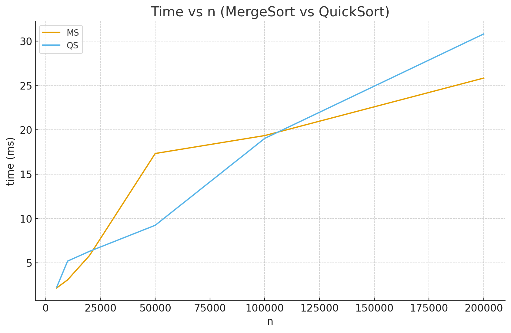
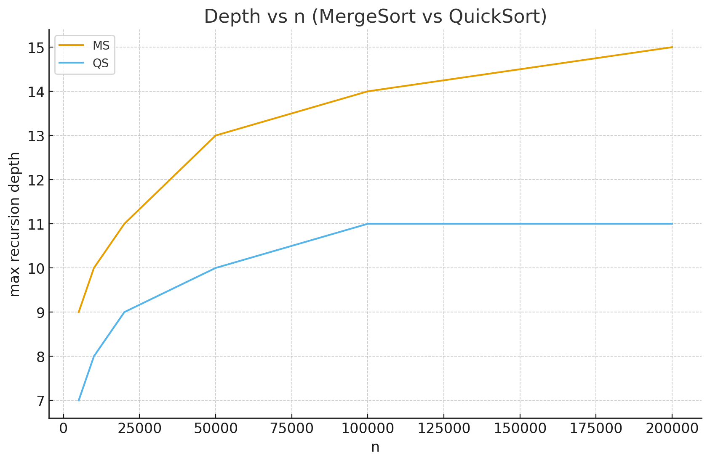
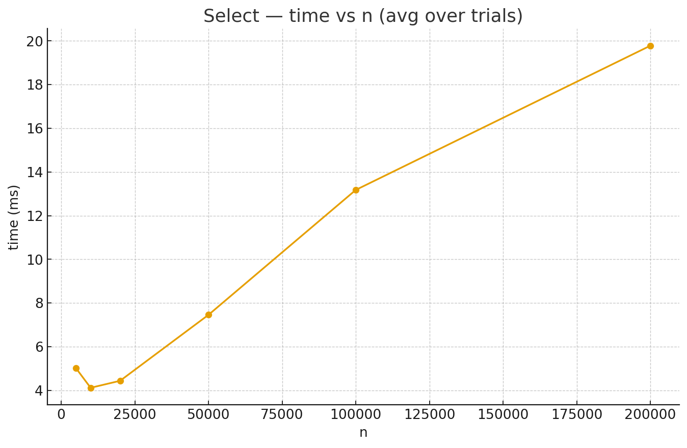
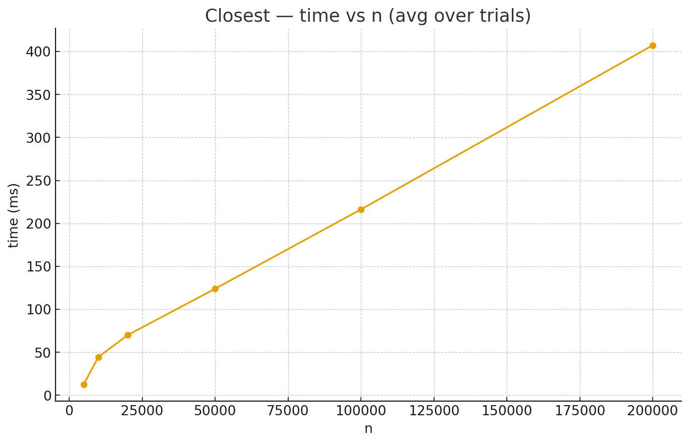

# DAA – Assignment 1

Divide & Conquer algorithms with safe recursion patterns, metrics, and empirical validation.

---

## Architecture

**Metrics layer**
- `DepthTracker` — increments on recursion enter/exit; stores `maxDepth`.
- `Counters` — `comps` (comparisons), `copies` (assignments), `allocs` (large allocations).

**Memory & depth control**
- **MergeSort** — single **reusable buffer** per sort (`allocs = 1`), **linear merge**, **cutoff** to insertion-sort on tiny ranges.
- **QuickSort** — **randomized pivot** + **smaller-first recursion** (tail-recurse only on the smaller side) ⇒ stack bounded ≈ `O(log n)` with high probability; in-place partition (`allocs = 0`).
- **Deterministic Select (MoM5)** — median-of-medians (groups of 5), **3-way partition**, recurse **only** into the side with `k` (prefer smaller side); in-place (`allocs = 0`).
- **Closest Pair (2D)** — classic D&C; points kept **sorted by y** via one shared **aux buffer** (`allocs = 1`); strip examines only ~7–8 neighbors per point.

---

## Recurrences & Θ-results

- **MergeSort**  
  `T(n) = 2T(n/2) + Θ(n)` → **Θ(n log n)** (Master, Case 2).  
  Depth `Θ(log n)`; buffer + cutoff improve constants.

- **QuickSort (randomized)**  
  Expected `Θ(n log n)` (random pivot rank).  
  Depth `O(log n)` w.h.p. via smaller-first; worst case `Θ(n²)` avoided in practice.

- **Deterministic Select (MoM5)**  
  `T(n) ≤ T(n/5) + T(7n/10) + Θ(n)` → **Θ(n)** (Akra–Bazzi; constant-fraction shrink).  
  Depth `O(log n)`; in-place, `allocs = 0`.

- **Closest Pair (2D)**  
  `T(n) = 2T(n/2) + Θ(n)` (merge-by-y + strip) → **Θ(n log n)** (Master, Case 2).  
  Depth `Θ(log n)`; one aux buffer reused.

---

## Measurements gathered with the CLI on random inputs; multiple trials per size.

- **Time vs n**
  - MergeSort and QuickSort grow close to n log n.MS benefits from linear merges, reusable buffer, and insertion       cutoff on small ranges. QS is in-place (fewer writes) and randomized, avoiding adversarial cases; typically competitive or faster at large n.
  - Select (MoM5) scales ≈ linear; small-n overhead (groups of 5) is visible, but linear growth dominates as n increases.
  - Closest Pair follows n log n with a larger constant (geometry + strip scan).

- **Depth vs n**
  - MergeSort: ≈ ⌊log₂ n⌋ + O(1) (very tight to theory).
  - QuickSort (randomized + smaller-first): stays around c·log₂ n, confirming bounded stack.
  - Select (MoM5), Closest: O(log n); Select’s depth is typically smaller.

- **Comparisons/ copies / allocs**
  - MS: allocs = 1 (single buffer); comparisons ~ n·log₂n.
  - QS: allocs = 0; more comparisons but fewer bulk copies (in-place).
  - Select: comparisons grow ≈ linearly; allocs = 0.
  - Closest: allocs = 1; linearithmic comparisons.

- **Constant-Factor Notes**
  - MS: allocs = 1 (single buffer); comparisons ~ n·log₂n.
  - QS: allocs = 0; more comparisons but fewer bulk copies (in-place).
  - Select: comparisons grow ≈ linearly; allocs = 0.
  - Closest: allocs = 1; linearithmic comparisons.

---

## Theory and Practice
- MergeSort matches Θ(n log n); depth ≈ log₂ n; constants low due to single buffer + cutoff.
- QuickSort matches Θ(n log n); stack bounded near O(log n); timings comparable to MS, often better at large n thanks to in-place work.
- Select (MoM5) shows Θ(n) scaling (time & comps); constants dominate at small n, linear growth wins as n increases.
- Closest Pair shows Θ(n log n); strip work constant per point; one-buffer behavior as designed.

## Plots

**Time vs n (MergeSort vs QuickSort)**  

**Depth vs n (MergeSort vs QuickSort)**  

**Select — time vs n**  

**Closest Pair — time vs n**  

